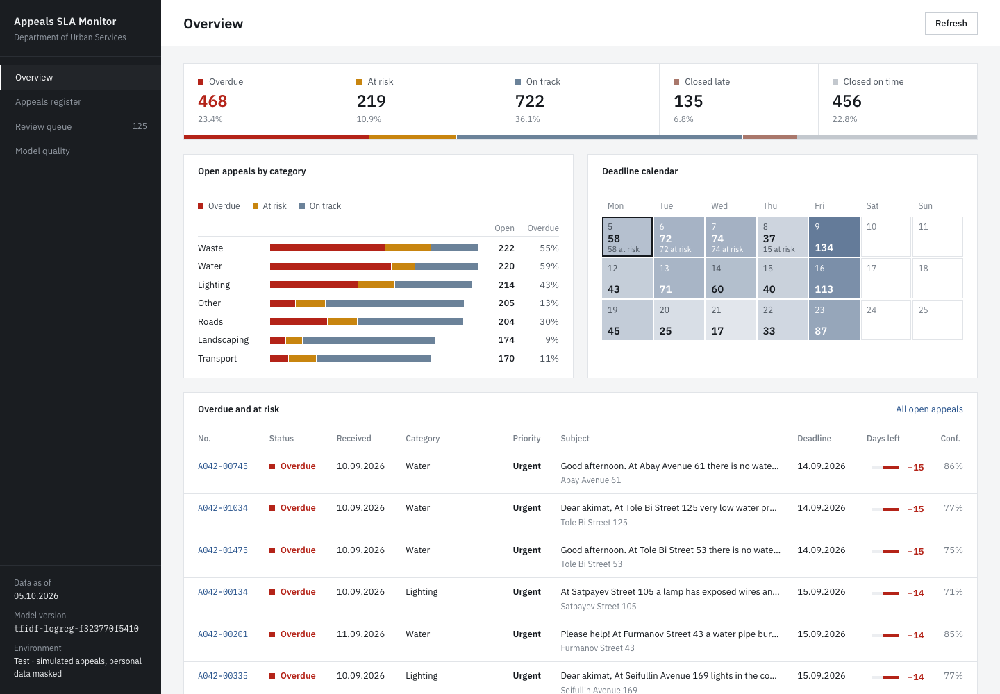

# Citizen Appeals Agent

[](https://github.com/Laura902l/citizen-appeals-agent/actions/workflows/ci.yml)
[](https://github.com/Laura902l/citizen-appeals-agent/actions/workflows/release.yml)

[](LICENSE)

A research prototype of an **AI agent for monitoring and classifying citizen appeals in
smart city infrastructure**. It is the software part of a course project (Applied
Software, Assignments 1–3) and implements the core of the planned system:

1. **Classification**: assigns each appeal to an infrastructure category (roads,
   lighting, water, waste, transport, landscaping, other) with a TF-IDF + logistic
   regression model; low-confidence predictions are sent to a **review queue**.
2. **SLA monitoring**: calculates the regulatory deadline in **business days** (weekends
   and a configurable holiday calendar are skipped) and sets the status *on track*,
   *at risk*, *overdue*, *closed on time* or *closed late*.
3. **Privacy**: masks phone numbers, e-mails and names before the text reaches the model.
4. **Reproducible experiments**: a seeded synthetic dataset, a model version tied to the
   fingerprint of its training data, and metrics and figures written to `reports/`.
5. **Monitoring dashboard**: a React web app on top of a small REST API with four pages:
   *Overview* (key figures, SLA status by category, upcoming deadlines, critical cases),
   *Appeals register* (sortable, filterable, with a detail panel showing the SLA timeline and
   audit data), *Review queue* (confirm or correct low-confidence categories) and
   *Model quality* (metrics and confusion matrix).



## Quick start

```bash
git clone https://github.com/Laura902l/citizen-appeals-agent.git
cd citizen-appeals-agent
python -m venv .venv && source .venv/bin/activate   # Windows: .venv\Scripts\activate
pip install -e ".[dev]"

appeal-agent generate --n 2000 --seed 42             # -> data/appeals.csv
appeal-agent train --seed 42 --min-accuracy 0.90     # -> models/, reports/metrics.json, confusion_matrix.png
appeal-agent monitor --today 2026-10-05              # -> reports/monitoring.csv, sla_status.png
appeal-agent deadline --submitted 2026-10-23 --category waste --urgent
```

### Web dashboard

```bash
cd dashboard && npm ci && npm run build && cd ..   # build the React app once (Node 20+)
appeal-agent serve --today 2026-10-05              # API + dashboard on http://127.0.0.1:8000
```

For front-end development run `appeal-agent serve` and, in a second terminal,
`cd dashboard && npm run dev` (Vite on http://localhost:5173 proxies `/api` to the server).

| Endpoint | Description |
|---|---|
| `GET /api/summary` | counts per SLA status, open appeals per category, review queue size |
| `GET /api/appeals?status=&category=&review=true&q=` | appeals, most urgent first |
| `GET /api/metrics` | classifier evaluation metrics |
| `GET /api/metrics/live` | the same metrics on the appeals being served (their stored category vs the model) |
| `GET /api/config` | categories and statuses |
| `POST /api/appeals/<id>/review` | `{"category": "roads"}`: operator confirms a label, SLA is re-evaluated |
| `POST /api/appeals/<id>/close` | operator closes an open appeal as of `--today`; the closing date is written back to the `--data` CSV |

Example output of `train` and `monitor` (seed 42):

```text
Model tfidf-logreg-…: accuracy≈0.96 macro_f1≈0.96 review_rate≈0.07
Processed 2000 appeals on 2026-10-05:
  on_track / at_risk / overdue / closed_on_time / closed_late / needs_review
```

## Using it as a library

```python
from datetime import date
from appeal_agent.config import load_config

engine = load_config().sla_engine()
result = engine.evaluate(date(2026, 10, 1), "water", today=date(2026, 10, 13))
print(result.deadline, result.remaining_business_days, result.status)
# 2026-10-15 2 at_risk
```

## Project structure

```text
src/appeal_agent/
├── business_calendar.py   business-day arithmetic (weekends + holidays)
├── sla.py                 SLA rules, deadlines and statuses
├── privacy.py             masking of personal data
├── urgency.py             keyword-based urgency detection
├── data_gen.py            reproducible synthetic dataset
├── classifier.py          TF-IDF + logistic regression, review queue, save/load
├── evaluation.py          accuracy, macro-F1, review rate, confusion matrix
├── agent.py               orchestrator of the whole pipeline
├── io.py                  CSV input/output
├── viz.py                 matplotlib figures
├── config.py              TOML configuration loading and validation
├── api.py                 dashboard service + REST API (standard library http.server)
├── cli.py                 `appeal-agent` command-line interface
└── data/default_config.toml   categories, SLA terms, holidays, keywords
tests/                     pytest suite (84 tests, ~99 % coverage)
dashboard/                 React + TypeScript web dashboard (Vite, vitest)
.github/workflows/         CI (ci.yml) and CD (release.yml)
docs/TECHNOLOGY_CHOICES.md justification of the technology stack
```

## Configuration

All business rules live in [`default_config.toml`](src/appeal_agent/data/default_config.toml)
and can be overridden with `appeal-agent --config my_config.toml …`. The SLA terms and
the holiday list are **illustrative values** for the prototype, not legal advice.

## Quality assurance and CI/CD

| Stage | Tool | Where |
|---|---|---|
| Lint and formatting | ruff | [`ci.yml`](.github/workflows/ci.yml), job `lint` |
| Static typing | mypy | `ci.yml`, job `lint` |
| Tests and coverage (≥ 90 %) | pytest, pytest-cov | `ci.yml`, job `test` (Ubuntu × Python 3.11/3.12/3.13, Windows, macOS) |
| Reproducible experiment with accuracy gate (≥ 0.90) | `appeal-agent` CLI | `ci.yml`, job `reproduce` (metrics in the job summary, reports as artifacts) |
| Front end: types, tests, build | tsc, vitest + Testing Library, Vite | `ci.yml`, job `dashboard` |
| Delivery | build + GitHub Release | [`release.yml`](.github/workflows/release.yml), triggered by a `v*.*.*` tag |
| Dependency updates | Dependabot | [`dependabot.yml`](.github/dependabot.yml) |

## Limitations

- The model is trained on **synthetic** English text; accuracy on real appeals will be lower.
- Personal-data masking is rule-based; an NER model is planned for the pilot.
- Photo analysis (FR9) is out of scope for this version.
- The API keeps data in memory and has no authentication yet (NFR2 role-based login is
  planned for the pilot); run it on localhost only.

## Contributing, license, citation

See [CONTRIBUTING.md](CONTRIBUTING.md). Released under the [MIT License](LICENSE).
If you use this software, please cite it using [CITATION.cff](CITATION.cff).
